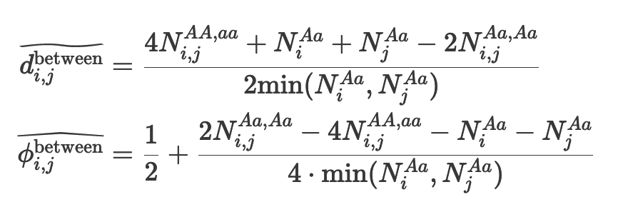
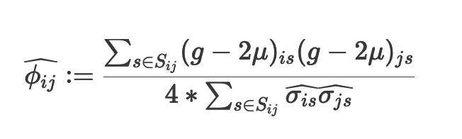

Last updated: `r Sys.Date()`

```{r, warning=FALSE, message=FALSE}
# Initial setup
scope <- c("https://www.googleapis.com/auth/cloud-platform")
token <- gargle::token_fetch(scopes = scope)
googleCloudStorageR::gcs_auth(token = token)
install.packages("UpSetR")
install.packages("reshape2")
install.packages("wesanderson")
library(UpSetR)
library(tidyverse)
library(reshape2)
library(wesanderson)
library(googleCloudStorageR)
library(gargle)
library(knitr)
```


## Motivation and background

I wanted to test how PC-Relate and KING perform in comparison to one another, since I was getting inaccuracies when running PC-Relate. These included 1) different samples flagged as being related from the gnomAD team and 2) known trios which were assigned as unrelated. Therefore, this report quickly goes over 1) how PC-Relate and KING work; 2) their accuracy 3) how they compare to the results from gnomAD and 4) their overall speed/performance.

## King vs PC-Relate background summary

Hail does a really good job at summarising the two relatedness estimators, which can be found [here](https://hail.is/docs/0.2/methods/relatedness.html).

### KING

KING was created by Manichaikul and colleagues in 2010 to address the gap in previous algorithms which assumed a homogeneous population structure. In contrast, KING  provides estimates of kinship in the presence of unknown population substructure.

KING infers IBD segments for all pairwise relationships using the between-family estimator, which can be viewed in the second formula below:


```{r, warning=FALSE, message=FALSE, out.width="50%"}
library(IRdisplay)

```

In essence, KING estimates kinship by using shared genotype counts as a measure of genetic distance between individuals.

As you can see, this works against any two individuals, so if the same input variants are used, the same results should be consistent across the cohort irrespective of how many individuals the KING relatedness coefficient is calculated for. Of course, the input variants do make a difference, and this will affect the results.

The KING method performs well in samples that contain individuals from distinct subpopulations with no admixture, however as demonstrated [in previous studies](https://core.ac.uk/download/pdf/82592421.pdf), the KING method can give incorrect relatedness inference for close relative pairs with different admixed ancestry. Therefore,  KING is robust to population structure, but not admixture.

Note: LD pruning is not recommended in KING, as per the [KING documentation](https://www.kingrelatedness.com/manual.shtml), however in the Hail docs, there is no mention of this. Furthermore, some [Hail threads](https://discuss.hail.is/t/ld-pruning-and-ibd/1986) have suggested that using pruned, independent variants is ok.

## PC-Relate

PC-Relate was created in 2016 by Conomos and colleagues in order to address a gap in assigning ancestry within admixed populations. Many relationship estimators make the assumption that rare alleles are shared through a common ancestor by which they are inherited by descent. However, this breaks down when multiple ancestry groups are present, and rare alleles might just be markers of the ancestry group, rather than individuals actually being related. In PC-Relate, population allele frequency is replaced with an individual allele frequency. This, in effect, puts an ancestry weight on the allele.

PC-Relate uses principal components to partition genetic correlations among sampled individuals into: 1) identity by descent/familial relatedness and 2) population structure (allele sharing due to common ancestry). It can be defined by the following mathematical formula:


```{r, warning=FALSE, message=FALSE, out.width="50%"}

```

ϕij  is constructed using residuals from linear regression models that include PCs as predictors. Because genetic similarities due to ancestry are regressed out, ϕij can measure genetic relatedness due to alleles shared by IBD between two individuals (i and j) from recent common ancestors.

As stated in the [paper](https://www.ncbi.nlm.nih.gov/pmc/articles/PMC4716688/) by Conomos and colleagues, PC-Relate is a model-free relatedness inference approach because it does not require (1) model-based estimates of individual ancestry and population-specific allele frequencies, (2) a likelihood model for IBD sharing, or (3) specification of a population genetic model. Because of this model-free approach, PC-Relate does not have the limitations that model-based methods do, namely 1) inaccurate estimates when misspecified or under-represented populations are included in the model and 2) confounding by familial relatedness due an inability to distinguish between ancestry groups and close relatives.

While there is no explicit requirement on whether pruned or unpruned variants should be used, the authors tested PC-Relate on a set of 100K pruned SNPs, leading me to believe that a set of independent SNPs is the better choice. The authors also tested PC-Relate on various numbers of PCs and found that relatedness estimates were broadly similar for the top 2, 5, 10, and 20 PCs. While this shows that PC-Relate is robust to the choice of PCs, this did break down when the authors tested PC-Relate on 100 PCs. In this model, variability substantially increased, however this number of PCs was 50 times more than required to explain population structure within the sample cohort. Therefore, the authors recommend choosing the number of PCs to be within a factor of 10 of the appropriate number required to explain population structure.

From what I read, PC-Relate seems to be highly accurate and performs well on large cohorts. In particular, PC-Relate performs well  when samples are admixed and have complex structure. However, one thing to keep in mind is that, unlike KING, kinship estimates from PC-Relate will change dependent on the samples used, since the number of samples will dictate the PCA.

## Testing accuracy

### Global-level accuracy

At the global level, PC-Relate was run using a MAF of 0.01 with 10 PCs ([as done in gnomAD](https://github.com/broadinstitute/gnomad_qc/blob/master/gnomad_qc/v3/sample_qc/v2_pc_relate.py#L32-L33)) on the entire HGDP+1kG dataset (3942 individuals in all). The sites used to infer relatedness were the set of ~90k well-behaved SNPs that Loic and I chose (located in `1kg_hgdp_densified_pca_new_variants/v0/hgdp1kg_tobwgs_joined_all_samples.mt`) which have the following properties:

* Autosomal, bi-allelic single nucleotide variants (SNVs) only
* Allele frequency > 0.1%
* Call rate > 99%
* LD-pruned with a cutoff of r2 = 0.1

Note: This is the same strategy that gnomAD used to infer relatedness (see [gnomAD v2.1 | MacArthur Lab](https://macarthurlab.org/2018/10/17/gnomad-v2-1/))

In order to test the accuracy of samples, I used a pedigree file from the 1000 genomes, found here: ftp://ftp.1000genomes.ebi.ac.uk/vol1/ftp/technical/working/20130606_sample_info/20130606_g1k.ped. This is essentially our 'truth' dataset.

Since I’m interested in how many samples were assigned as being related (e.g., mother, father, child), rather than just retaining maximally independent samples, I use all samples assigned a relatedness score of 0.1 or greater (I gave a bit of leeway around 0.125, which is the assignment for second-degree relatives).

When testing the performance of PC-Relate at the global level, here are the results for samples which overlap the 1kG callset (the HGDP dataset is excluded, since I could not find pedigree information for it):

```{r, warning=FALSE, message=FALSE}
## Load in relatedness file and filter out individuals who are not in the HGDP+1kG dataset
ped <- read.delim("pedigree.txt")
rownames(ped) <- ped$Individual.ID

# tidy up pedigree data and assign related samples
ped_related <- ped %>% separate_rows(Siblings, Second.Order, Third.Order) %>% select(Individual.ID, Paternal.ID, Maternal.ID, Siblings, Second.Order, Population, Relationship)
related <- c()
for (row in 1:nrow(ped_related)){
    if ( ped_related$Paternal.ID[row] != "0" | ped_related$Maternal.ID[row] != "0" | ped_related$Siblings[row] != "0" | ped_related$Second.Order[row] != "0" ){
        related <- c(related, "Y")
    }
    else {
       related <- c(related, "N")
       }
}
ped_related$related <- related
ped_related <- ped_related %>% filter(., related == "Y") %>% select(., -related)
# only keep individuals in HGDP/1kG dataset
metadata <- read.delim("gnomad.genomes.v3.1.hgdp_1kg_subset.sample_meta.tsv")
metadata$s <- gsub("v3.1::", "", metadata$s) %>% gsub("[^0-9]$", "", .)
ped_related <- ped_related[which((ped_related$Individual.ID %in% metadata$s & ped_related$Paternal.ID %in% metadata$s) | (ped_related$Individual.ID %in% metadata$s & ped_related$Maternal.ID %in% metadata$s) | (ped_related$Individual.ID %in% metadata$s & ped_related$Siblings %in% metadata$s) | (ped_related$Individual.ID %in% metadata$s & ped_related$Second.Order %in% metadata$s)),]
ped_related <- melt(ped_related, id.vars=c("Individual.ID", "Population", "Relationship")) %>% melt(., id.vars=c("variable", "Population", "Relationship")) %>% select(Population, Relationship, value)
colnames(ped_related) <- c("Population", "Relationship", "Individual.ID")
ped_related <- ped_related[-which(duplicated(ped_related$Individual.ID)),]
ped_related <- ped_related[grep("^NA|HG", ped_related$Individual.ID),]
rownames(ped_related) <- ped_related$Individual.ID
ped_related <- ped_related[which(ped_related$Individual.ID %in% metadata$s),]

# define not in function
'%!in%' <- function(x,y)!('%in%'(x,y))

# Define function for method performance
method_performance <- function(method, truth, pedigree_table, tgp){
    # filter my data to only samples in the tgp
    test <- method[which(method %in% tgp)]
    total_samples <- length(test)
    truth <- truth
    false_positive <- test[test %!in% truth]
    false_negative <- truth[truth %!in% test]
    true_positive <- test[which(test %!in% false_positive)]
    true_negative <- tgp[-which(tgp %in% c(true_positive, false_negative, false_positive))]
    name <- deparse(substitute(method))
    method_df <- data.frame(method = name, false_positive = length(false_positive), false_negative = length(false_negative), related_samples = length(true_positive))
    sensitivity <- length(true_positive)/(length(true_positive) + length(false_negative))
    print(paste0("Sensitivity = ", round(sensitivity, 2)*100, "%"))
    specificity <- length(true_negative)/( length(true_negative) + length(false_positive) )
    print(paste0("Specificity = ", round(specificity, 2)*100, "%"))
    accuracy <- (length(true_negative) + length(true_positive))/(length(true_negative) + length(true_positive) + length(false_negative) + length(false_positive))
    print(paste0("Accuracy = ", round(accuracy, 2)*100, "%"))
    print(paste0("n missed samples (false negatives) = ", length(false_negative), " out of ", length(truth), " (", round(length(false_negative)/length(truth), 2)*100, "%)"))
    print(paste0("n correctly-predicted related samples (true positives) = ", length(true_positive), " out of ", length(truth), " (", round(length(true_positive)/length(truth), 2)*100, "%)"))
    print(paste0("n incorrectly-predicted related samples (false positives) = ", length(false_positive), " out of ", total_samples, " samples (", round(length(false_positive)/total_samples, 2)*100, "%)"))
    # Get who these samples are
    missed_related_samples <- pedigree_table[false_negative,]
    return(method_df)
}

# test on PC-Relate global dataset
pc_rel_unpruned <- read.csv("pc_relate_global_matrix.csv")
pc_rel_unpruned <- apply(pc_rel_unpruned,2,function(x) gsub("v3.1::", "", x)) %>% gsub("[^0-9]$", "", .) %>% as.data.frame(.)
pc_rel_global <- unique(melt(pc_rel_unpruned, id.vars=3)[[3]])
truth <- ped_related$Individual.ID
tgp <- metadata[which(metadata$subsets.tgp == "true"),"s"]
pc_rel_global <- method_performance(pc_rel_global, truth, ped_related, tgp)
```

Here's a quick overview of what these measurements mean:

* Sensitivity is the proportion of related samples with a true related result (a kinship estimate above 0.1); e.g., the measure of the number of true positives / number of true positives + false positives)

* Specificity is the proportion of unrelated individuals who have an unrelated kinship estimate (below 0.1). It is equal to the number of true negatives / true negatives + false positives

* Total accuracy = Number of correct assessments (e.g., true positives + true negatives)/Number of all assessments (true and false positives + true and false negatives)

With that, we can see that PC-Relate does pretty well, but it's not perfect. While PC-Relate did not have any false negatives, it did have 28 false positives (2%).

Now let's test the same for KING at the global level, which was run on a set of 10k randomly-sampled (unpruned) variants.

```{r, warning=FALSE, message=FALSE}
# Test on KING global, 10k randomly sampled
king_global_unpruned <- read.csv("king_global_matrix_10k.csv")
king_global_unpruned <- apply(king_global_unpruned,2,function(x) gsub("v3.1::", "", x)) %>% gsub("[^0-9]$", "", .) %>% as.data.frame(.)
king_global <- unique(melt(king_global_unpruned, id.vars=3)[[3]])
king_global <- method_performance(king_global, truth, ped_related, tgp)
```

We can see that for KING, the accuracy drops significantly. Out of 2,084 samples, 337 were misclassified as related. As an aside, I'm actually unsure of how the above pedigree for 1kg was generated. That is, if the related samples are assigned by stating they are, that can leave a lot of room for false positives and negatives. But if the relatedness classification is from running a relatedness estimate on it, then that means KING performs much worse than PC-Relate in regards to assigning false positives.

### Continental-level accuracy

I also wanted to test how PC-Relate and KING perform at the continental level (in this case, only running these two methods on NFE samples). The reason for this is due to the fact that upon my intial exploration of these methods, some known trios were classified as unrelated when running PC-Relate at the continental (NFE) level, but correctly classified as related at the global level.

Let's see how PC-Relate performs again at the continental level only. This test, as above, was run using the 90k pruned variants described above.

```{r, warning=FALSE, message=FALSE}
# Test pc_relate at the continental level on NFE samples
pc_rel_unpruned_nfe <- read.csv("pc_relate_nfe_matrix.csv")
pc_rel_unpruned_nfe <- apply(pc_rel_unpruned_nfe,2,function(x) gsub("v3.1::", "", x)) %>% gsub("[^0-9]$", "", .) %>% as.data.frame(.)
## filter samples in pedigree to just NFE samples
ped_nfe <- ped_related %>% filter(Population %in% c("CEU","TSI","GBR","IBS"))
pc_rel_nfe <- unique(melt(pc_rel_unpruned_nfe, id.vars=3)[[3]])
truth <- ped_nfe$Individual.ID
tgp_nfe <- metadata[which(metadata$subsets.tgp == "true"),] %>% filter(., population_inference.pop == "nfe") %>% pull(s)
pc_rel_nfe <- method_performance(pc_rel_nfe, truth, ped_nfe, tgp_nfe)
```

Compared to PC-Relate at the global level, the overall accuracy goes down. In particular, the sensitivity drops quite a bit with the number of correctly-predicted related samples going down. The number of missed samples also increase at the continental level. While I'm a little confused by this result, it could be due to the fact that estimates of relatedness that rely on allele frequencies (such as PC-Relate) perform worse when sample sizes are small (see this [paper](https://www.nature.com/articles/hdy201752)).

Now let's test how KING performs at the continental level (using 10k randomly sampled, unpruned variants).

```{r, warning=FALSE, message=FALSE}
## Test KING at the continental level (NFE) on 10k randomly sampled variants
king_nfe_unpruned <- read.csv("king_nfe_matrix_10k.csv")
king_nfe_unpruned <- apply(king_nfe_unpruned,2,function(x) gsub("v3.1::", "", x)) %>% gsub("[^0-9]$", "", .) %>% as.data.frame(.)
king_nfe <- unique(melt(king_nfe_unpruned, id.vars=3)[[3]])
king_nfe <- method_performance(king_nfe, truth, ped_nfe, tgp_nfe)
```

Compared to the global level, the specificity does go down at the continental level, however the total accuracy stays pretty consistent. This makes sense- KING performs relatedness estimates on pairs of samples and, unlike PC-Relate, does not rely on allele frequencies. While KING might perform worse on some populations over others (e.g., admixed populations), the overall estimate should be the same irrespective of the scale.

Let's compare all methods.

```{r, warning=FALSE, message=FALSE}
# plot
performance_summary <- rbind(pc_rel_global, king_global, pc_rel_nfe, king_nfe)
performance_summary$scale <- c(rep("global", 2), rep("nfe", 2))
performance_summary <- melt(performance_summary)
colnames(performance_summary) <- c("method","scale","classification","n_samples")
ggplot(performance_summary, aes(fill=classification, y=n_samples, x=method)) +
    geom_bar(position="stack", stat="identity") +
    theme_minimal() + scale_fill_manual(values=wes_palette(n=3, name="FantasticFox1")) +
    facet_grid(cols = vars(scale), scales = "free") + ggtitle("Relatedness test performance, all methods")
```

From the barplots, we can see that KING at both the global and continental level has a much higher false positive rate. We can also see that PC-Relate misses more samples at the continental scale compared to the global scale.

## Testing input variants for KING

Input variants will affect the overall relatedness estimates, and therefore I wanted to test the extent to which they affect KING relatedness estimates. While PC-Relate calls for pruned variants, it's unclear (from what I read) whether and how this affects KING relatedness estimates. I therefore tested the perfomance of KING at the continental level using 90k pruned variants (the same dataset described above).

```{r, warning=FALSE, message=FALSE}
# Test KING at the continental level (NFE) on 90k pruned variants
king_nfe_90k <- read.csv("king_nfe_matrix_90k.csv")
king_nfe_90k <- king_nfe_90k[-which(king_nfe_90k$i_s == king_nfe_90k$j_s),]
king_nfe_90k <- apply(king_nfe_90k,2,function(x) gsub("v3.1::", "", x)) %>% gsub("[^0-9]$", "", .) %>% as.data.frame(.)
king_nfe_90k <- unique(melt(king_nfe_90k, id.vars=3)[[3]])
truth <- ped_nfe$Individual.ID
king_nfe_90k <- method_performance(king_nfe_90k, truth, ped_nfe, tgp_nfe)
```

By every single metric, it's clear that the accuracy goes up quite when using 90k pruned variants rather than 10k randomly sub-sampled variants. When using 90k pruned variants, sensitivity, specificity, and accuracy go up to 100%, meaning no samples were missed or incorrectly predicted.

Here's a visualisation of the results from the two variant sets:

```{r, warning=FALSE, message=FALSE, fig.height=5, fig.width=8}
# Plot
performance_summary_king <- rbind(king_nfe, king_nfe_90k)
performance_summary_king <- melt(performance_summary_king)
colnames(performance_summary_king) <- c("method","classification","n_samples")
ggplot(performance_summary_king, aes(fill=classification, y=n_samples, x=method)) +
    geom_bar(position="stack", stat="identity") +
    theme_minimal() + scale_fill_manual(values=wes_palette(n=3, name="FantasticFox1")) +
    ggtitle("Relatedness test performance, KING")
```

We can see that there's a substantial decrease in false positives with the 90k pruned variant set, which makes it clear that KING should be run using pruned samples (and perhaps a larger number of variants as well?).

## Comparing pruned samples in these tests vs gnomAD pruned samples

Finally, let's investigate how pruned samples from KING and PC-Relate compare to pruned samples in gnomAD. The discrepancy between my called samples and gnomAD's was one of the main reasons as to why I started this investigation. That is- why would there be a discrepancy in samples that are called in my tests versus gnomAD? Does gnomAD also miss related samples? Or incorrectly call samples?

As opposed to the tests above, the tests below prune samples based off of a [maximal independent set](https://hail.is/docs/0.2/methods/misc.html#hail.methods.maximal_independent_set), which prunes individuals until no close relationships remain.

Let's first see how gnomAD results compare to the pruned set of related samples calculated by PC-Relate at the global level.

```{r, warning=FALSE, message=FALSE}
gnomad_related_samples <- metadata[which(metadata$gnomad_release == "false"),"s"]
# pc_relate global
pc_relate_global <- read.csv("pc_relate_global_maximal_independent_set.csv")
pc_relate_global <- apply(pc_relate_global,2,function(x) gsub("v3.1::", "", x)) %>% gsub("[^0-9]$", "", .)
listInput <- list(gnomAD = gnomad_related_samples, my_test = pc_relate_global)
upset(fromList(listInput), order.by = "freq")
```

With PC-Relate run on the global scale,  662 samples were found by the gnomAD crew but only 638 related samples were found in my test (for the list of related samples in my test, see the html file [here](https://main-web.populationgenomics.org.au/tob-wgs/tob_wgs_hgdp_1kg_pc_relate/v0/removed_samples.html)). In total, that left 611 overlapping, with 51 of the non-overlapping samples in the gnomAD dataset and 27 samples found exclusively in my test.

In many of the instances where samples were found in gnomAD but not in my test, this was simply due to differences in pruning - that is, a parent might be pruned out rather than a child. This can be seen below where the majority of non-overlapping samples exclusive to either gnomAD or my run of PC-Relate are in the truth dataset.


```{r, warning=FALSE, message=FALSE}
# Investigate whether the individuals exclusively found in gnomAD or my test are within the pedigree file
truth_overlap <- function(method){
    unique_gnomad <- gnomad_related_samples[-which(gnomad_related_samples %in% method)] %>% {tgp[tgp %in% .]}
    if (length(unique_gnomad) > 0){
        unique_gnomad_overlap <- length(which(unique_gnomad %in% ped_related$Individual.ID))
        print(paste0("gnomAD: ", unique_gnomad_overlap, " out of ", length(unique_gnomad), " samples (", round(unique_gnomad_overlap/length(unique_gnomad),2)*100 ,"%) overlap with the truth related dataset."))
    }
    else{
        print("no overlap between gnomAD and my test")
    }
    unique_my_test <- method[-which(method %in% gnomad_related_samples)] %>% {tgp[tgp %in% .]}
    unique_my_test_overlap <- length(which(unique_my_test %in% ped_related$Individual.ID))
    print(paste0("My test: ", unique_my_test_overlap, " out of ", length(unique_my_test), " samples (", round(unique_my_test_overlap/length(unique_my_test),2)*100 ,"%) overlap with the truth related dataset."))
}

truth_overlap(pc_relate_global)
```

While gnomAD used PC-Relate to call related samples, I also wanted to see what the overlap was between samples called as related by gnomAD and those flagged as related by my test using KING at the global level (using 10k randomly-sampled variants).

```{r, warning=FALSE, message=FALSE}
# king global
king_global <- read.csv("king_10k_global_related_samples_maximal_independent_set.csv")
king_global <- apply(king_global,2,function(x) gsub("v3.1::", "", x)) %>% gsub("[^0-9]$", "", .)
listInput <- list(gnomAD = gnomad_related_samples, my_test = king_global)
upset(fromList(listInput), order.by = "freq")
```

```{r, warning=FALSE, message=FALSE}
truth_overlap(king_global)
```

As expected, the overlap is poorer, with 590 samples overlapping and around 70 samples unique to gnomAD and my dataset.

However, fewer pruned samples called by PC-Relate overlap with the gnomAD dataset compared to KING at the continental scale.

```{r, warning=FALSE, message=FALSE}
gnomad_related_samples <- metadata[which(metadata$gnomad_release == "false"),] %>% filter(., population_inference.pop == "nfe") %>% pull(s)
# pc_relate NFE
pc_relate_nfe <- read.csv("pc_relate_nfe_maximal_independent_set.csv")
pc_relate_nfe <- apply(pc_relate_nfe,2,function(x) gsub("v3.1::", "", x)) %>% gsub("[^0-9]$", "", .)
listInput <- list(gnomAD = gnomad_related_samples, my_test_nfe = pc_relate_nfe)
upset(fromList(listInput), order.by = "freq")
```


```{r, warning=FALSE, message=FALSE}
truth_overlap(pc_relate_nfe)
```


```{r, warning=FALSE, message=FALSE}
## king
king_nfe <- read.csv("king_10k_nfe_related_samples_maximal_independent_set.csv")
king_nfe <- apply(king_nfe,2,function(x) gsub("v3.1::", "", x)) %>% gsub("[^0-9]$", "", .)
listInput <- list(gnomAD = gnomad_related_samples, my_test_king = king_nfe)
upset(fromList(listInput), order.by = "freq")
```

```{r, warning=FALSE, message=FALSE}
truth_overlap(king_nfe)
```

## Performance

Finally, some notes on performance.

King itself is actually very fast. When testing KING at the continental level, it took less than an hour (42 minutes) on [this script](https://github.com/populationgenomics/ancestry/blob/main/scripts/hail_batch/king_tob_samples/king_nfe.py) of 90k variants (see the log file [here](https://batch.hail.populationgenomics.org.au/batches/4839/jobs/2)) and under a minute when I tested it in `test` with the files already subsampled and repartitioned (see the output [here](https://batch.hail.populationgenomics.org.au/batches/4804)). KING also remained consistently fast when run on variants at the global level. After repartitioning the matrix table (which took the most amount of time), KING took less than ten minutes to run using 20 preemptible workers (10k rows, 3942 samples).

For PC-Relate, the run time seems to be slower than KING. For example, [this script](https://github.com/populationgenomics/ancestry/blob/main/scripts/hail_batch/hgdp1kg_tobwgs_nfe_pc_relate/hgdp_1kg_tob_wgs_pc_relate.py) took 2 hours and 10 minutes (see [Sign in - Google Accounts](https://batch.hail.populationgenomics.org.au/batches/4694/jobs/2)). This falls in line previous Hail [threads](https://discuss.hail.is/t/ld-pruning-and-ibd/1986/7) I've seen, which claim that pc_relate is slower than KING. However, I'm not sure how either of these scale when variants and samples increase.
